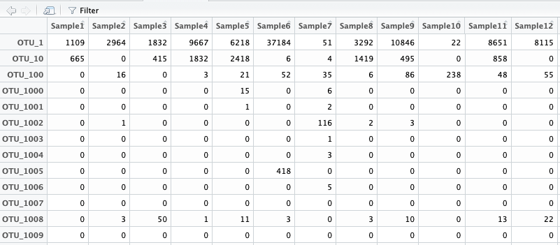
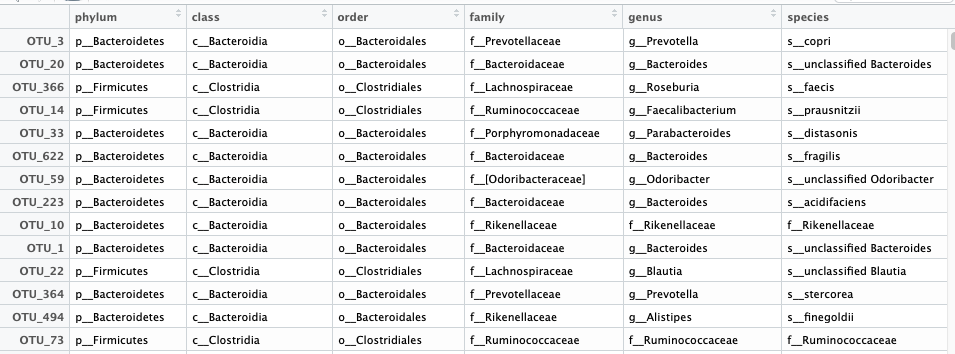
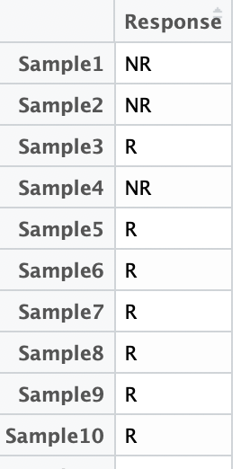

# looPA: Microbiome feature identification using leave-one-out with Permanova assessment
looPA is a permutation based method, which can account for phylogenetic relatedness between taxonomic features and identify important features for further investigation.

### Usage
```{r}
looPA(otutable,taxonomy, sampleInfo, outcomeVar, numRep=200,useMoreCores=TRUE,
      tree=NULL,distanceMetric="Bray Curtis")
```
### Parameters
|Parameters	||
|------|-----|	
|otutable|	OTU table. Rows correspond to OTUs while columns correspond to samples. Row names (OTU names) and column names(sample names) must be provided.|
|taxonomy|	Taxonomy table. Rows correspond to OTUs while columns correspond to the taxonomic levels. Row names (OTU names) must match the row names of the OTU table.|
|sampleInfo|	Patient information. Rows correspond to samples while columns correspond to covariates. Row names (sample names) must match the column names of the OTU table.|
|outcomeVar|	The outcome of interest. For now we only accept single covariate.|
|numRep|	Number of repeated PERMANOVA test for each feature. Default is 200.|
|useMoreCores|	Shall we use more cores of the computer for this job? By default, the number of cores used will be the number of cores of the computer -1. If you give an integer value, looPA will use it as the number of cores you want to use.|
|tree|	The phylogenetic information correspond to OTU table.|
|distanceMetric|	The distance metric used in PERMANOVA test. We offer three choices, "Bray Curtis" (the default), "Unweighted UniFrac"(requires tree information), and "Weighted UniFrac"(requires tree information).|

<!---### What the data should look like

###### otutable



###### taxonomy



###### sampleInfo

 --->

### Results
|Results||
|------|-----|	
|looPAresult|	A dataframe with the names of the selected taxa and their medians and confidence intervals over repeated PERMANOVA tests.|
|looPAplot|	A plot showing the selected features.|


### Example
```{r}
library(looPA)
outcomeVar<-"Response"

looPAResult<-looPA(otutable,taxonomy, sampleInfo, outcomeVar,useMoreCores=TRUE,
tree=tree,distanceMetric="Weighted UniFrac")
```